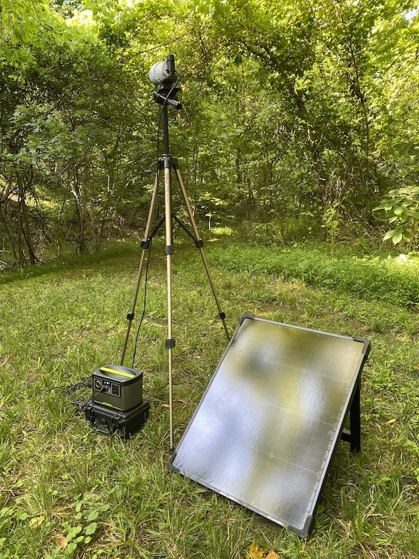
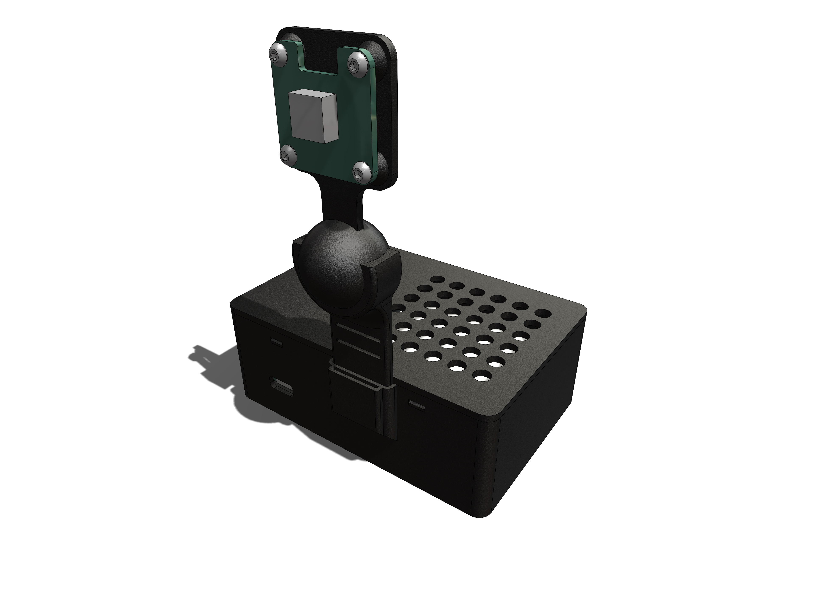
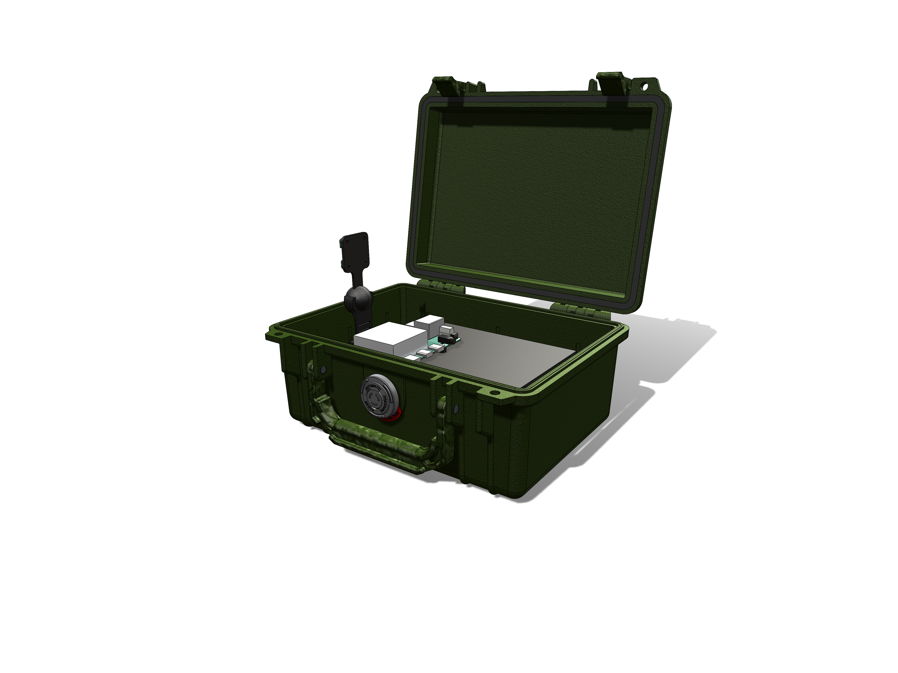
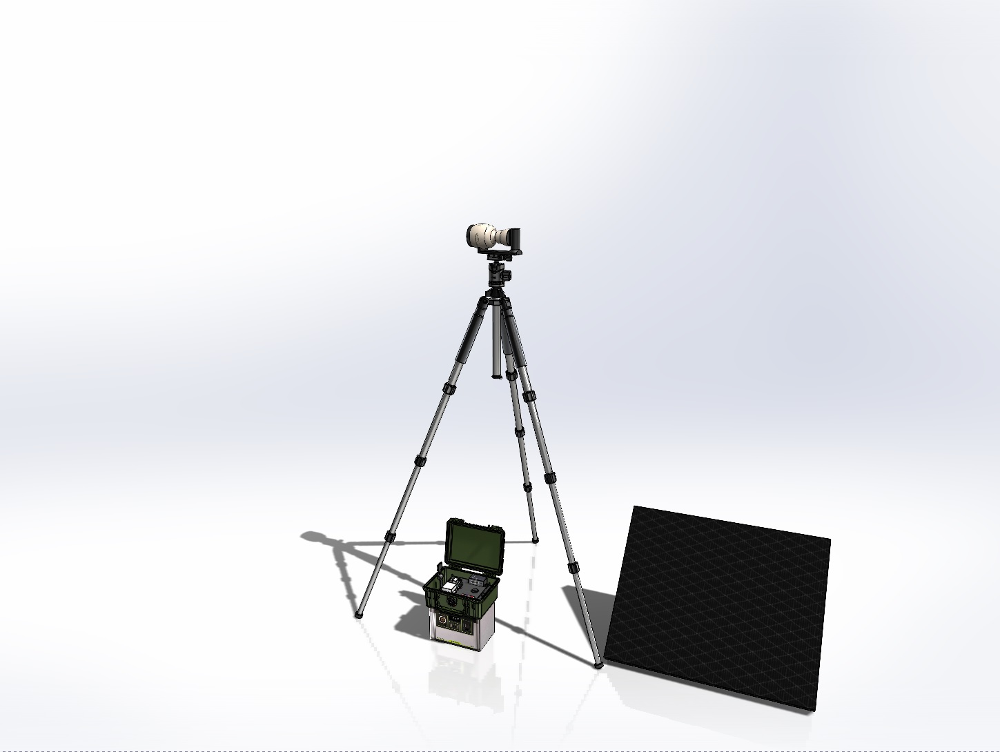

# Teachable Camera Hardware

## Introduction

This repository contains the design files that we used for building a Teachable Camera. The Teachable Camera is built using the [Google Coral Dev Board](https://coral.ai/), commercially available components, and a few 3D printed parts. We experimented with a number of different design configurations to aid in development and allow the system to be tested in a more realistic environment.

_Teachable Camera in the wild_

## Software

For details about the software that runs on the Coral see the [Teachable Camera Software](https://github.com/IQTLabs/Teachable-Camera) repository

## Design Configurations

There were three designs that we experimented with during the development of the project. Follow the links for more details on each design.

### [Design 1 - Benchtop Testing (Simple 3D Printed Coral Case)](./design-1.md)

### [Design 2 - Light Field Deployment (Coral in Pelican Case with USB Battery)](./design-2.md)

### [Design 3 - Extended Run Field Deployment (Coral in Pelican Case, GoalZero Battery, Ubiquity IP Camera](./design-3.md)

## Design Features of Note

### Power/Solar

For the field system (Design 3) power we chose the GoalZero [200X power supply](https://www.goalzero.com/) and the [Boulder 50W](https://www.goalzero.com/) solar panel. The GoalZero power supplies are consumer friendly, the X series is light weight, and there are lots of options for additional battery or solar capacity. And GoalZero is an [IQT Portfolio Company](https://www.iqt.org/goal-zero/)!

### PoE Power

We needed a way to power the Ubiquity Power over Ethernet (PoE) IP camera using a 5V battery but were unable to located a commerical solution. To solve this we sourced [DC-DC transformer]() to step up the battery voltage from 5V to 48V coupled with a generic [PoE injector]() to power the camera. This solution ended up working quite well and could probably be utilized for other projects too. 

### 3D Printing

The 3D printed parts were printed with the Prusa i3 mk3 using PETG filament. PETG is a high temperature material and seems to hold up well even in the summer heat.

## Third Party Files 3D Models

In addition to the models included in this repository, the following files from GRAB CAD were also used in the SolidWorks Assembly for illustration purposes.

- https://grabcad.com/library/google-coral-dev-board-1
- https://grabcad.com/library/coral-camera-1
- https://grabcad.com/library/pelican-case-1150-1
- https://grabcad.com/library/tripod-gtt204-1
