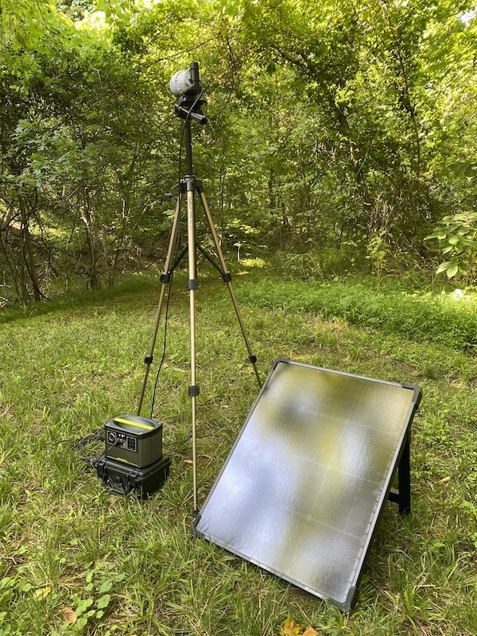
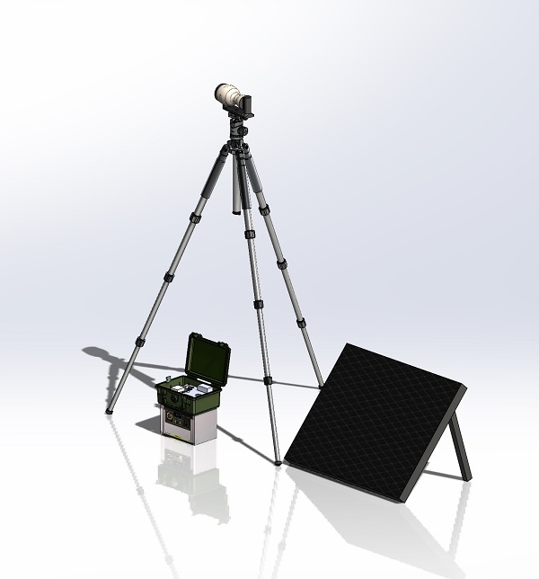
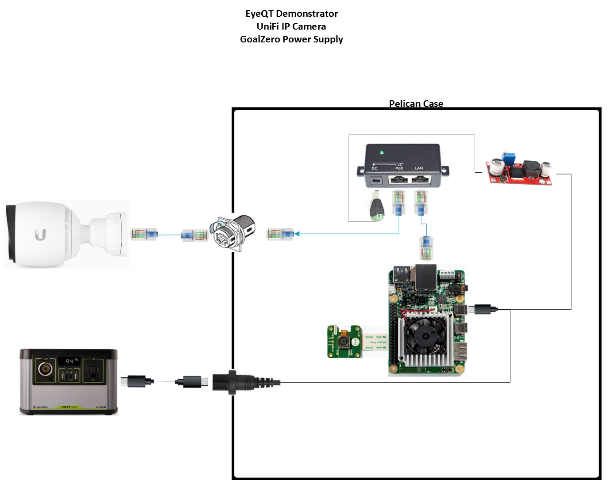
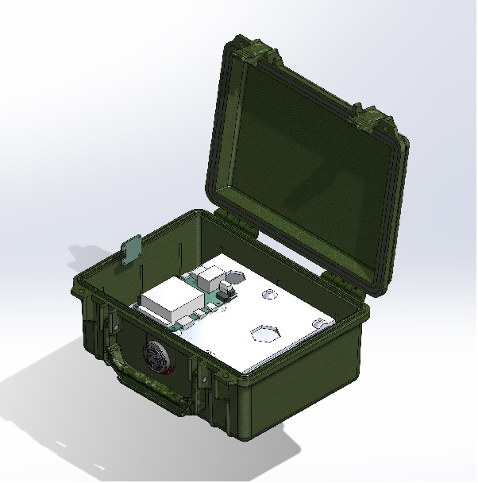
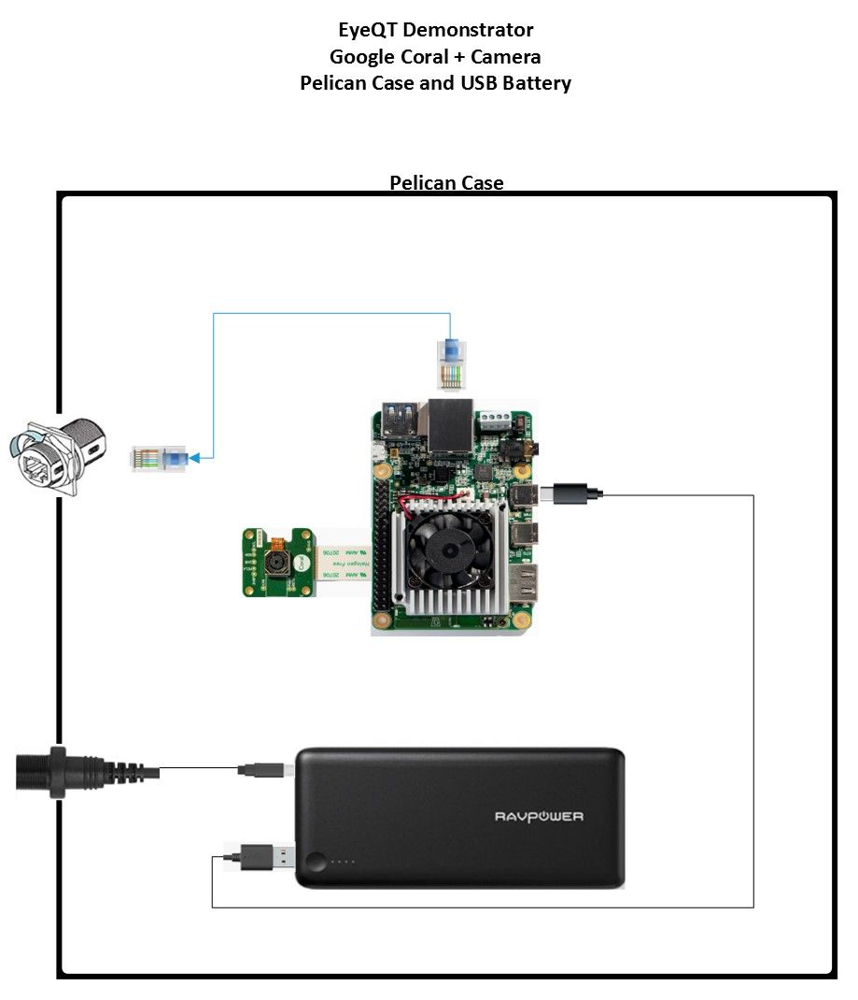
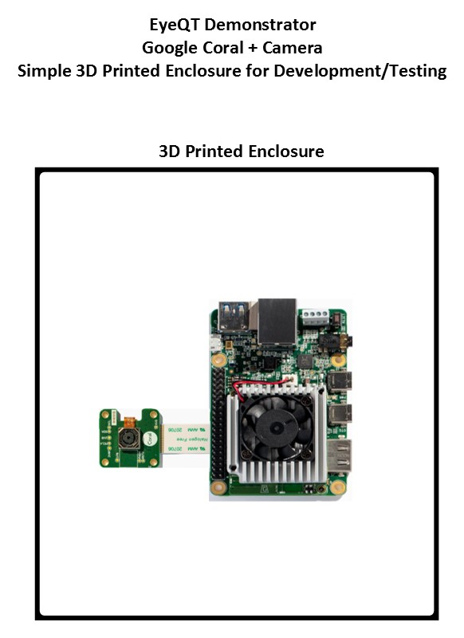

# EyeQT Hardware

## Introduction

This repository contains the design files for building the supporting hardware for the EyeQT Machine Learning demonstrator.

## Designs

There were three designs used by different team members during the development of the project.

### EyeQT with IP Camera

The is the full system demonstrator with a high quality security camera, pelican case, and GoalZero power supply capable of operating for 24h+ (potentially continuous operation with optional solar panel).

#### Design files

[Link to Design Files](3d-design-files)

#### Wiring

### EyeQT with Google Coral Camera

This is a simple system demonstrator utilizing the Google Coral Camera module housed in a Pelican case with a USB battery that will operator for ~18h.

#### Design files

[Link to Design Files](3d-design-files)

#### Wiring

### Simple Google Coral + Camera Enclosure

This is a simple enclosure intended to house the Google Coral + Camera during development.

#### Design files

[Link to Design Files](3d-design-files)

#### Wiring

## BOM

### Key Hardware

| Item                    | Quantity | Price | Link                                                                                                                                                                                                        | Power Datasheet Spec | Power Actual Measured | Weight  | Other |
|-------------------------|----------|-------|-------------------------------------------------------------------------------------------------------------------------------------------------------------------------------------------------------------|----------------------|-----------------------|---------|-------|
| Google Coral Dev Board  | 1        | $150  | https://coral.ai/products/dev-board                                                                                                                                                                         | 15W                  |                       | < 1lbs  |       |
| UniFi G3 Pro Camera     | 1        | $263  | https://www.bhphotovideo.com/c/product/1387763-REG/ubiquiti_networks_uvc_g3_pro_unifi_video_g3_pro_1080p.html                                                                                               | 12.5W                |                       | 1.5lbs  |       |
| POE Injector            | 1        | $15   | https://www.amazon.com/WS-GPOE-1-WM-Gigabit-Passive-Ethernet-Injector/dp/B00ENNUWO4/ref=sr_1_3?crid=3F1UOEQOGUEO&dchild=1&keywords=24v+poe+injector+dc&qid=1591818504&sprefix=24v+poe+i%2Caps%2C146&sr=8-3  | N/A                  |                       | < 1lbs  |       |
| Ethernet Cable          | 2        | $20   | TBD                                                                                                                                                                                                         | N/A                  |                       | < 1lbs  |       |
| Misc Connectors         | 1        | $25   | https://www.amazon.com/gp/product/B07KSSV8LD/ref=ox_sc_act_title_3?smid=A323VFV6W4CN1S&psc=1     https://www.amazon.com/gp/product/B08169ZB5C/ref=ox_sc_act_title_6?smid=A3MDC9KUHU6B27&psc=1               | N/A                  |                       |         |       |
| Pelican 1150            | 1        | $60   | https://www.bhphotovideo.com/c/product/83166-REG/Pelican_1150_000_110_1150_Case_with_Foam.html                                                                                                              | N/A                  |                       | ~3lbs   |       |
| Heavy Duty Tripod       | 1        | $100  | TBD                                                                                                                                                                                                         | N/A                  |                       | ~10lbs  |       |
| GoalZero Yeti 200X      | 1        | $299  | https://www.goalzero.com/shop/portable-power/goal-zero-yeti-200x/                                                                                                                                           | 187Wh (Li-ion)       |                       | 5lbs    |       |

### Optional Hardware

| Item                                                                        | Quantity  | Price            | Link                                                                                                                                                                                                                                | Power Datasheet Spec  | Power Actual Measured  | Weight   | Other                         |
|-----------------------------------------------------------------------------|-----------|------------------|-------------------------------------------------------------------------------------------------------------------------------------------------------------------------------------------------------------------------------------|-----------------------|------------------------|----------|-------------------------------|
| LoRa Comms  (option 1)     LoPy4 (LoRa) +  pytrack (GPS/GLONASS/DeepSleep)  | 2         | $178.00 (qty 2)  | https://www.sparkfun.com/products/14674     https://www.arrow.com/en/products/pytrack/pycom-ltd?gclid=Cj0KCQjw2PP1BRCiARIsAEqv-pQYv6_zZTOPEGluY6ujHW9V3s7nRozhEoCmTeF9tF68LORfolGYmOAaAqaiEALw_wcB                                  | 330mW                 |                        | 3 oz.    | Range: up to 5km  BW: 125kHz  |
| LoRa Comms  (option 2)  Adafruit Feather                                    | 2         | $70.00 (qty 2)   | https://www.adafruit.com/product/3178                                                                                                                                                                                               | ~400mW (estimated)    |                        | << 3oz   | Range: ?  BW: 125kHz          |
| 7in Touch LCD                                                               | 1         | $76.99           | https://www.amazon.com/Lebula-Touchscreen-Raspberry-1024X600-Capacitive/dp/B07VNX4ZWY/ref=sr_1_4?crid=2ZLF6BWNR49J9&dchild=1&keywords=7+in+capacitive+touchscreen+raspberry+pi&qid=1591041969&sprefix=7in+capac%2Caps%2C139&sr=8-4  | ?                     | 5.2W                   | 0.5lbs   |                               |

### Optional Power Supplies

| Item                                                                        | Quantity  | Price            | Link                                                                                                                                                                                                                                | Power Datasheet Spec  | Power Actual Measured  | Weight   | Other                         |
|-----------------------------------------------------------------------------|-----------|------------------|-------------------------------------------------------------------------------------------------------------------------------------------------------------------------------------------------------------------------------------|-----------------------|------------------------|----------|-------------------------------|
| LoRa Comms  (option 1)     LoPy4 (LoRa) +  pytrack (GPS/GLONASS/DeepSleep)  | 2         | $178.00 (qty 2)  | https://www.sparkfun.com/products/14674     https://www.arrow.com/en/products/pytrack/pycom-ltd?gclid=Cj0KCQjw2PP1BRCiARIsAEqv-pQYv6_zZTOPEGluY6ujHW9V3s7nRozhEoCmTeF9tF68LORfolGYmOAaAqaiEALw_wcB                                  | 330mW                 |                        | 3 oz.    | Range: up to 5km  BW: 125kHz  |
| LoRa Comms  (option 2)  Adafruit Feather                                    | 2         | $70.00 (qty 2)   | https://www.adafruit.com/product/3178                                                                                                                                                                                               | ~400mW (estimated)    |                        | << 3oz   | Range: ?  BW: 125kHz          |
| 7in Touch LCD                                                               | 1         | $76.99           | https://www.amazon.com/Lebula-Touchscreen-Raspberry-1024X600-Capacitive/dp/B07VNX4ZWY/ref=sr_1_4?crid=2ZLF6BWNR49J9&dchild=1&keywords=7+in+capacitive+touchscreen+raspberry+pi&qid=1591041969&sprefix=7in+capac%2Caps%2C139&sr=8-4  | ?                     | 5.2W                   | 0.5lbs   |                               |
