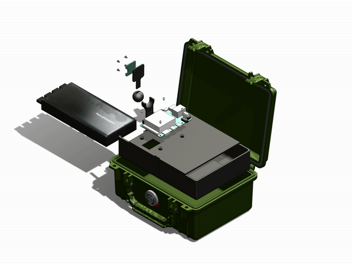

# Teachable Camera Hardware

## Introduction

This repository contains the design files for building the supporting hardware for the Teachable Camera Machine Learning demonstrator. The key hardware component of the project [Google Coral Dev Board]() and we experimented with a number of different design configurations to aid in development and allow more realistic environment testing.

## Software

For details about the software that runs on the Coral see the [Teachable Camera Software]() repository

## Design Configuration

There were three designs that we experimented with during the development of the project.

### [Design 1 - Simple 3D Printed Coral Case]()

### [Design 2 - Coral in Pelican Case with USB Battery]()

### [Design 3]()

IMG

## Design Features

### Power/Solar

For system power we chose the GoalZero [200X power supply]() and the [Boulder 50W]() solar panel. The GoalZero power supplies are consumer friendly, the X series is light weight, and there are lots of options for additional battery or solar capacity. And GoalZero is an [IQT Portfolio Company](https://www.iqt.org/goal-zero/)!

### PoE Power

We needed a way to power the PoE IP camera using a battery but were unable to located a commerical solution. To solve this we sourced [DC-DC transformer]() to step up the battery voltage from 5V to 48V and used a generic [PoE injector]() to power the camera. This solution ended up working quite well and could probably be utilized for other projects too. 

### 3D Printing

The 3D printed parts were printed with the Prusa i3 mk3 using PETG filament. PETG is a high temperature material and seems to hold up well even in the summer heat.