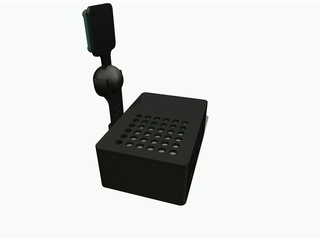
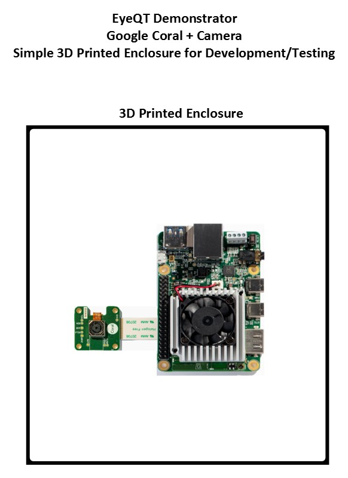

# Design 1

The Benchtop Testing hardware is a simple case configuration that houses the Google Coral Development Board and provides a mount which allows you to aim the Coral Camera. The enclosure is 3D printed and provides basic protection for the electronics. This configuration was used to do most of the development and testing of the system.

## Key Components

- Coral Dev Board
- Coral Camera
- 3D Printed Case

## Design Files 
-   [SolidWorks, STLs](./design-files/design-1/)

## Images and Assembly Diagram

## Wiring

## BOM

| Item                               | Quantity | Price | Link                                                                                                                                                                                          | Power Datasheet Spec | Power Actual Measured | Weight | Other |
|------------------------------------|----------|-------|-----------------------------------------------------------------------------------------------------------------------------------------------------------------------------------------------|----------------------|-----------------------|--------|-------|
| Google Coral Dev Board             | 1        | $150  | https://coral.ai/products/dev-board                                                                                                                                                           | 15W                  |                       | < 1lbs |       |
| Google Coral Camera                | 1        | $20   | https://coral.ai/products/camera/                                                                                                                                                             |                      |                       |        |       |
