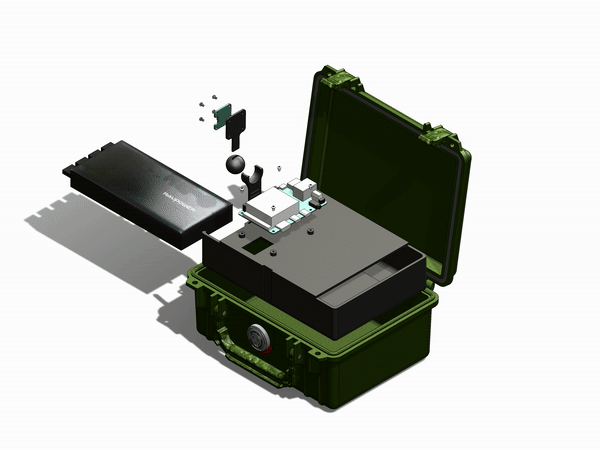
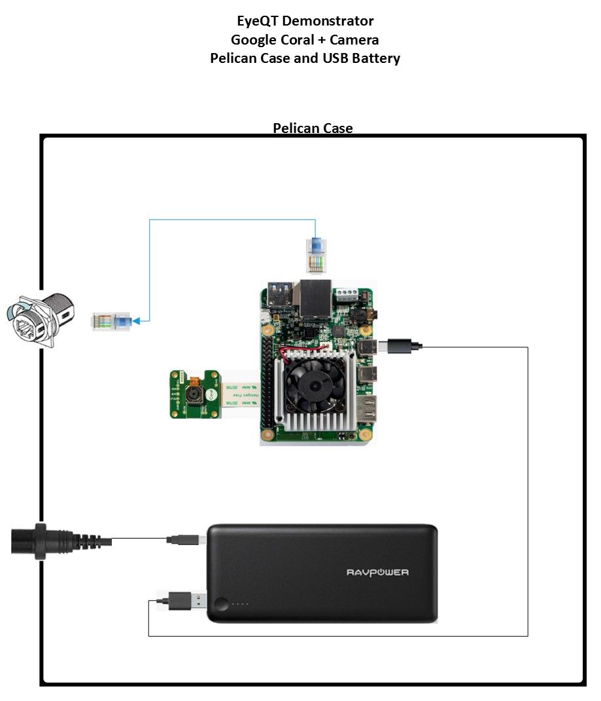

# Design 2

This is a simple system demonstrator utilizing the Google Coral Camera module housed in a Pelican case with a USB battery that will operator for ~18h.

## Key Components
- Coral Dev Board 
- Coral Camera
- Pelican Case
- USB Battery 

## Design Files 
-   [SolidWorks, STLs](./design-files/design-2/)

## Images and Assembly Diagram

## Wiring

## Power Consumption and Run Time

Below are cursory power consumption and run time measurements in order to establish the baseline battery life of the system. Note that no significant effort went into minimizing power consumption, and that the system can theoretically run longer than this.

| Device          | Power Consumption        |
|-----------------|--------------------------|
| Coral Dev Board | 6.2W                     |

| Power Source | Run Time |
|---------|----------|
| RAV 26800mAh (134Wh) | ~9.5h |

## BOM

| Item                               | Quantity | Price | Link                                                                                                                                                                                          | Power Datasheet Spec | Power Actual Measured | Weight | Other |
|------------------------------------|----------|-------|-----------------------------------------------------------------------------------------------------------------------------------------------------------------------------------------------|----------------------|-----------------------|--------|-------|
| Google Coral Dev Board             | 1        | $150  | https://coral.ai/products/dev-board                                                                                                                                                           | 15W                  |                       | < 1lbs |       |
| Google Coral Camera                | 1        | $20   | https://coral.ai/products/camera/                                                                                                                                                             |                      |                       |        |       |
| Misc Connectors                    | 1        | $25   | https://www.amazon.com/gp/product/B07KSSV8LD/ref=ox_sc_act_title_3?smid=A323VFV6W4CN1S&psc=1     https://www.amazon.com/gp/product/B08169ZB5C/ref=ox_sc_act_title_6?smid=A3MDC9KUHU6B27&psc=1 | N/A                  |                       |        |       |
| Pelican 1150                       | 1        | $60   | https://www.bhphotovideo.com/c/product/83166-REG/Pelican_1150_000_110_1150_Case_with_Foam.html                                                                                                | N/A                  |                       | ~3lbs  |       |
| RAVPower 26800mAh USB Battery Pack | 1        | $45   | https://www.amazon.com/RAVPower-Portable-Charger-26800mAh-External/dp/B012NIQG5E/ref=sr_1_6?dchild=1&keywords=rav+usb+battery+pack&qid=1598463632&sr=8-6                                      | 26800mAh             |                       | ~1lbs  |       |