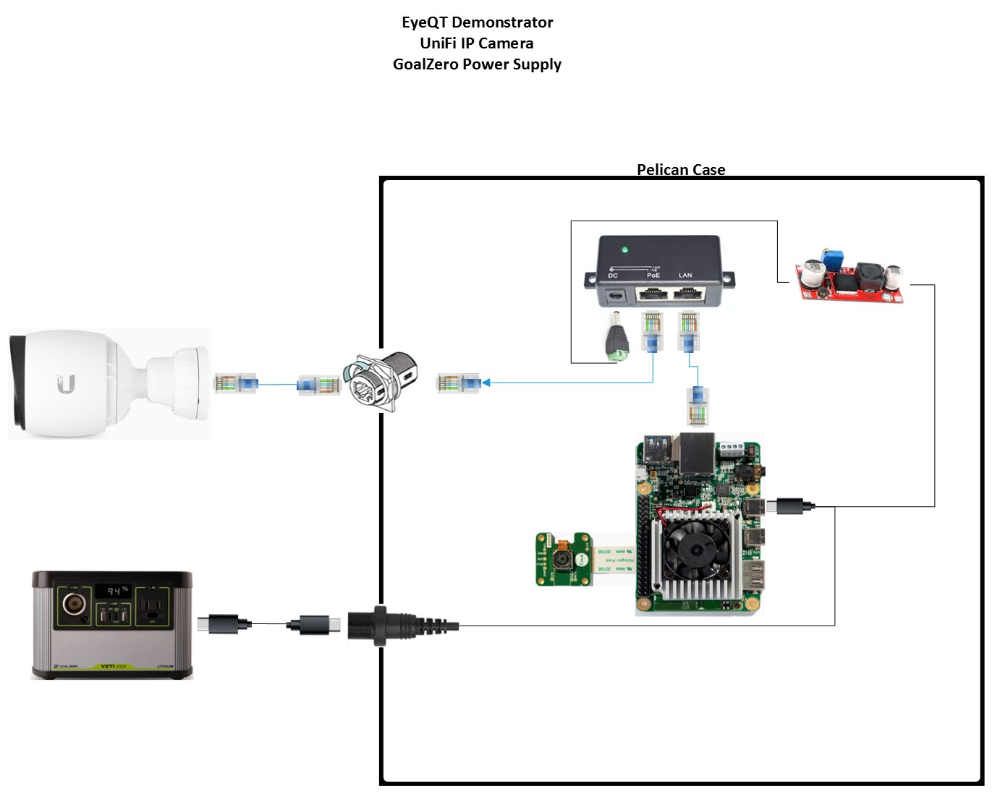

# Design 3

The is the full system demonstrator with a high quality security camera, pelican case, and GoalZero power supply capable of operating for 24h+ (potentially continuous operation with optional solar panel).

## Key Components

- Coral Dev Board
- IP Camera (Ubiquity G3 Pro)
- Pelican Case
- GoalZero Battery

## Design Files 
-   [SolidWorks, STLs](./design-files/design-3/)

## Images and Assembly Diagram

## Wiring

## Power Consumption and Run Time

Below are cursory power consumption and run time measurements in order to establish the baseline battery life of the system. Note that no significant effort went into minimizing power consumption, and that the system can theoretically run longer than this.

| Device          | Power Consumption        |
|-----------------|--------------------------|
| Coral Dev Board | 6.2W                     |
| Ubiquity G3 Pro | 4.3/11.1W (day/night IR) |

| Power Source                                                                    | Run Time |
|---------------------------------------------------------------------------------|----------|
| GoalZero 200X (~200Wh)                                                          | ~25h     |
| GoalZero 200X full recharge using 50W solar panel while the system is operating | ~10h     |

## BOM

### Key Hardware

| Item                             | Quantity | Price | Link                                                                                                                                                                                                       | Power Datasheet Spec | Power Actual Measured | Weight | Other |
|----------------------------------|----------|-------|------------------------------------------------------------------------------------------------------------------------------------------------------------------------------------------------------------|----------------------|-----------------------|--------|-------|
| Google Coral Dev Board           | 1        | $150  | https://coral.ai/products/dev-board                                                                                                                                                                        | 15W                  |                       | < 1lbs |       |
| UniFi G3 Pro Camera              | 1        | $263  | https://www.bhphotovideo.com/c/product/1387763-REG/ubiquiti_networks_uvc_g3_pro_unifi_video_g3_pro_1080p.html                                                                                              | 12.5W                |                       | 1.5lbs |       |
| POE Injector                     | 1        | $15   | https://www.amazon.com/WS-GPOE-1-WM-Gigabit-Passive-Ethernet-Injector/dp/B00ENNUWO4/ref=sr_1_3?crid=3F1UOEQOGUEO&dchild=1&keywords=24v+poe+injector+dc&qid=1591818504&sprefix=24v+poe+i%2Caps%2C146&sr=8-3 | N/A                  |                       | < 1lbs |       |
| DC-DC Transformer                | 1        | $8.59 | https://www.amazon.com/Yeeco-Converter-Adjustable-Transformer-Stabilizer/dp/B074J9D278/ref=sr_1_11?dchild=1&keywords=5v+to+48v&qid=1598463288&sr=8-11                                                      |                      |                       |        |       |
| Ethernet Cable                   | 2        | $20   | TBD                                                                                                                                                                                                        | N/A                  |                       | < 1lbs |       |
| Misc Connectors                  | 1        | $25   | https://www.amazon.com/gp/product/B07KSSV8LD/ref=ox_sc_act_title_3?smid=A323VFV6W4CN1S&psc=1     https://www.amazon.com/gp/product/B08169ZB5C/ref=ox_sc_act_title_6?smid=A3MDC9KUHU6B27&psc=1              | N/A                  |                       |        |       |
| Pelican 1150                     | 1        | $60   | https://www.bhphotovideo.com/c/product/83166-REG/Pelican_1150_000_110_1150_Case_with_Foam.html                                                                                                             | N/A                  |                       | ~3lbs  |       |
| Heavy Duty Tripod                | 1        | $50   | TBD                                                                                                                                                                                                        | N/A                  |                       | ~10lbs |       |
| GoalZero Yeti 200X               | 1        | $299  | https://www.goalzero.com/shop/portable-power/goal-zero-yeti-200x/                                                                                                                                          | 187Wh (Li-ion)       |                       | 5lbs   |       |
| GoalZero Builder 50W Solar Panel | 1        | $150  | https://www.goalzero.com/shop/solar-panels/boulder-50-solar-panel/                                                                                                                                         |                      |                       |        |       |

### Optional LoRa Radio

| Item                                                                        | Quantity  | Price            | Link                                                                                                                                                                                                                                | Power Datasheet Spec  | Power Actual Measured  | Weight   | Other                         |
|-----------------------------------------------------------------------------|-----------|------------------|-------------------------------------------------------------------------------------------------------------------------------------------------------------------------------------------------------------------------------------|-----------------------|------------------------|----------|-------------------------------|
| LoRa Comms  (option 1)     LoPy4 (LoRa) +  pytrack (GPS/GLONASS/DeepSleep)  | 2         | $178.00 (qty 2)  | https://www.sparkfun.com/products/14674     https://www.arrow.com/en/products/pytrack/pycom-ltd?gclid=Cj0KCQjw2PP1BRCiARIsAEqv-pQYv6_zZTOPEGluY6ujHW9V3s7nRozhEoCmTeF9tF68LORfolGYmOAaAqaiEALw_wcB                                  | 330mW                 |                        | 3 oz.    | Range: up to 5km  BW: 125kHz  |
| LoRa Comms  (option 2)  Adafruit Feather                                    | 2         | $70.00 (qty 2)   | https://www.adafruit.com/product/3178                                                                                                                                                                                               | ~400mW (estimated)    |                        | << 3oz   | Range: ?  BW: 125kHz          |
