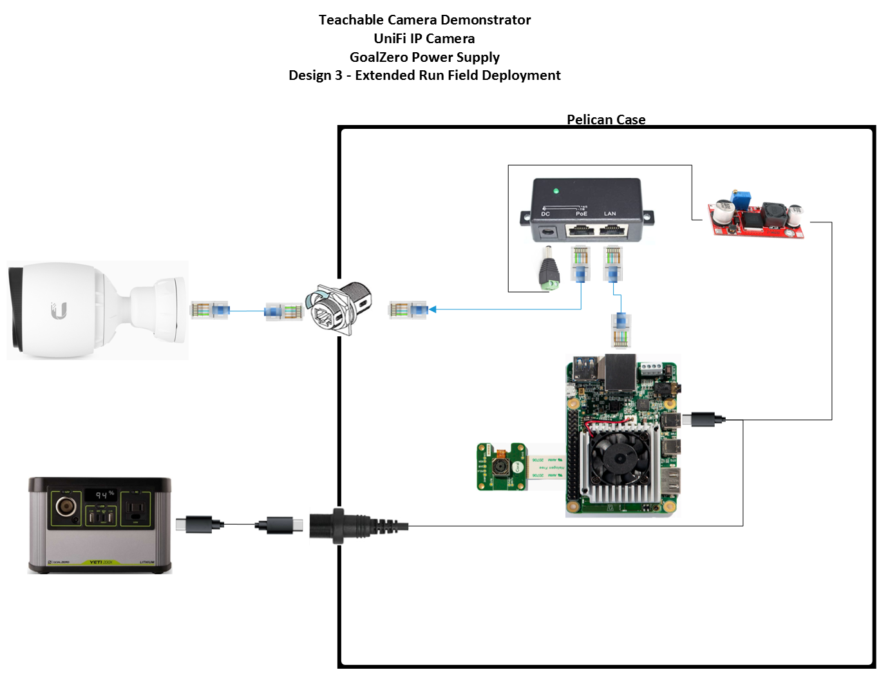

# Design 3

The Extended Run Field Deployment hardware is an advanced configuration with a durable case that houses the Google Coral Development Board, a GoalZero battery/solar power system, and a PoE Ubiquity G3 Pro security camera. 

To power system we chose the GoalZero 200X power station and the Boulder 50W solar panel. The GoalZero power stations are consumer friendly, the X series is light weight, and there are lots of options for additional battery or solar capacity. With this current configuration, the 200X power station provides 24+ hours of run time and with the solar panel (and about 10 hours of sun light) it is capable of running continuously. Note that no significant effort went into minimizing power consumption, and that the system can theoretically run longer than this.

For this configuration we needed a way to power the Ubiquity G3 Pro Power over Ethernet (PoE) IP camera using a 5V USB source but were unaware of a commercial solution to accomplish this. To solve this, we sourced an off-brand DC-DC transformer from Amazon to step up the battery voltage from 5V to 48V.  We then connected it with a generic PoE injector to power the camera. To our surprise this solution ended up working quite well and could probably be utilized for other field PoE projects too.

## Key Components

- Coral Dev Board
- IP Camera (Ubiquity G3 Pro)
- Pelican Case
- GoalZero Battery

## Design Files 
-   [SolidWorks, STLs](./design-files/design-3/)

## Images and Assembly Diagram

## Wiring

## Power Consumption and Run Time

Below are cursory power consumption and run time measurements in order to establish the baseline battery life of the system. Note that no significant effort went into minimizing power consumption, and that the system can theoretically run longer than this.

| Device          | Power Consumption        |
|-----------------|--------------------------|
| Coral Dev Board | 6.2W                     |
| Ubiquity G3 Pro | 4.3/11.1W (day/night IR) |

| Power Source                                                                    | Run Time |
|---------------------------------------------------------------------------------|----------|
| GoalZero 200X (~200Wh)                                                          | ~25h     |
| GoalZero 200X full recharge using 50W solar panel while the system is operating | ~10h     |

## BOM

### Key Hardware

| Item                             | Quantity | Price | Link                                                                                                                                                                                                       | Power Datasheet Spec | Power Actual Measured | Weight | Other |
|----------------------------------|----------|-------|------------------------------------------------------------------------------------------------------------------------------------------------------------------------------------------------------------|----------------------|-----------------------|--------|-------|
| Google Coral Dev Board           | 1        | $150  | https://coral.ai/products/dev-board                                                                                                                                                                        | 15W                  |                       | < 1lbs |       |
| UniFi G3 Pro Camera              | 1        | $263  | https://www.bhphotovideo.com/c/product/1387763-REG/ubiquiti_networks_uvc_g3_pro_unifi_video_g3_pro_1080p.html                                                                                              | 12.5W                |                       | 1.5lbs |       |
| POE Injector                     | 1        | $15   | https://www.amazon.com/WS-GPOE-1-WM-Gigabit-Passive-Ethernet-Injector/dp/B00ENNUWO4/ref=sr_1_3?crid=3F1UOEQOGUEO&dchild=1&keywords=24v+poe+injector+dc&qid=1591818504&sprefix=24v+poe+i%2Caps%2C146&sr=8-3 | N/A                  |                       | < 1lbs |       |
| DC-DC Transformer                | 1        | $8.59 | https://www.amazon.com/Yeeco-Converter-Adjustable-Transformer-Stabilizer/dp/B074J9D278/ref=sr_1_11?dchild=1&keywords=5v+to+48v&qid=1598463288&sr=8-11                                                      |                      |                       |        |       |
| Ethernet Cable                   | 2        | $20   | TBD                                                                                                                                                                                                        | N/A                  |                       | < 1lbs |       |
| Misc Connectors                  | 1        | $25   | https://www.amazon.com/gp/product/B07KSSV8LD/ref=ox_sc_act_title_3?smid=A323VFV6W4CN1S&psc=1     https://www.amazon.com/gp/product/B08169ZB5C/ref=ox_sc_act_title_6?smid=A3MDC9KUHU6B27&psc=1              | N/A                  |                       |        |       |
| Pelican 1150                     | 1        | $60   | https://www.bhphotovideo.com/c/product/83166-REG/Pelican_1150_000_110_1150_Case_with_Foam.html                                                                                                             | N/A                  |                       | ~3lbs  |       |
| Heavy Duty Tripod                | 1        | $50   | TBD                                                                                                                                                                                                        | N/A                  |                       | ~10lbs |       |
| GoalZero Yeti 200X               | 1        | $299  | https://www.goalzero.com/shop/portable-power/goal-zero-yeti-200x/                                                                                                                                          | 187Wh (Li-ion)       |                       | 5lbs   |       |
| GoalZero Builder 50W Solar Panel | 1        | $150  | https://www.goalzero.com/shop/solar-panels/boulder-50-solar-panel/                                                                                                                                         |                      |                       |        |       |

